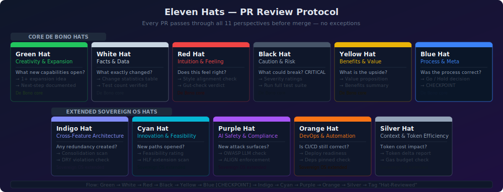

🌐 **Live Preview (App Gallery):** [https://Grumpified-OGGVCT.github.io/Jules_Choice/](https://Grumpified-OGGVCT.github.io/Jules_Choice/)


<p align="center">
  
</p>

# Jules Sandbox

> **An experiment in autonomous AI creativity — now equipped with the full HLF toolchain.**
> Jules is given full creative freedom in this repository, backed by a military-grade
> Hieroglyphic Logic Framework (HLF) that turns natural-language intent into
> deterministic, gas-metered, cryptographically auditable execution.

---

## What's Inside

<p align="center">
  
</p>

### 🔧 HLF Toolchain (Synced from Sovereign Agentic OS)

| Layer | Components | Purpose |
|-------|-----------|---------|
| **Governance** | `hls.yaml` · `bytecode_spec.yaml` · `host_functions.json` · `ALIGN_LEDGER.yaml` · `openclaw_strategies.yaml` · `module_import_rules.yaml` · `service_contracts.yaml` | Living Spec, bytecode VM opcodes, gas costs, trust ledger, plugin policies |
| **Core Agents** | 28 Python modules in `agents/core/` | Sentinel · Scribe · Arbiter (Aegis triad) · Spindle DAG engine · 14-Hat thinking engine · Dream state consolidation · Crew orchestrator · ACFS worktree isolation · Memory scribe · Event bus · Tool forge · Tool registry · Host function dispatcher |
| **Gateway** | `agents/gateway/` (5 files) | Router · Sentinel gate · Bus · Ollama dispatch |
| **Plugins** | `plugins/openclaw-sovereign/` | OpenClaw Ollama plugin for trusted tool execution |
| **Security** | `security/seccomp.json` | Container-level syscall hardening |
| **Docs** | 11 files in `docs/` | HLF grammar reference · Instinct reference · RFC 9000 series · Getting started guide · OpenClaw integration · Benchmarks · Execution storyboard |
| **Syntax** | `syntaxes/hlf.tmLanguage.json` | VS Code / TextMate syntax highlighting for `.hlf` files |
| **Tools** | `tools/grammar-generator.py` | Auto-generates EBNF grammar from the Living Spec |

### 🎭 Persona & Decision Framework

- `config/personas/` — 17 persona YAML definitions + shared mandates
- `config/decision_matrix.yaml` — Deterministic, auditable decision matrix
- `governance/templates/` — Fourteen Hats PR review protocol
- `governance/` — CoVE QA prompt, audit results, CI lite, peer review protocol

### 📦 Applications

- `examples/hello_world/` — First self-contained output
- `logs/ethics.log` — Ethical decision audit trail

---

## Architecture

```
┌─────────────────────────────────────────────────────────────────┐
│  Human / Jules Intent                                           │
│  "Build me a dashboard that tracks agent gas usage"             │
└──────────────┬──────────────────────────────────────────────────┘
               │
               ▼
┌──────────────────────────────────────────────────────────────────┐
│  Gateway Layer                                                   │
│  Router → Sentinel Gate → Ollama Dispatch → Bus                 │
│  (model routing, ALIGN policy check, tier enforcement)          │
└──────────────┬──────────────────────────────────────────────────┘
               │
               ▼
┌──────────────────────────────────────────────────────────────────┐
│  Agent Executor (main.py)                                        │
│  Text → Ollama/OpenRouter → HLF source → hlfc compile → hlfrun │
│  Gas-metered execution with host function dispatch              │
└──────────────┬──────────────────────────────────────────────────┘
               │
               ▼
┌──────────────────────────────────────────────────────────────────┐
│  Spindle DAG Engine + 14-Hat Thinking + Dream Consolidation     │
│  Crew orchestration with ACFS worktree isolation                │
│  Memory Scribe (SQLite + vector search) + Event Bus             │
└──────────────┬──────────────────────────────────────────────────┘
               │
               ▼
┌──────────────────────────────────────────────────────────────────┐
│  Host Functions (ACFS-confined, tier-gated)                      │
│  READ · WRITE · SPAWN · HTTP_GET · WEB_SEARCH · SLEEP          │
│  FORGE_TOOL · OPENCLAW_SUMMARIZE                                │
│  Tool Forge: auto-generates tools after 3 loop failures        │
└─────────────────────────────────────────────────────────────────┘
```

---

## Vision & Goals

The overarching vision, sprint goals, and fundamental instincts guiding Jules are defined in [`jules_vision.yaml`](jules_vision.yaml). These form the core intent behind autonomous decisions.

## Decision Framework

Jules uses a deterministic, auditable decision matrix to decide what to do next. The principles and priority algorithms are defined in [`config/decision_matrix.yaml`](config/decision_matrix.yaml). Every significant decision is recorded in [`logs/decisions.log`](logs/decisions.log).

## How It Works

<p align="center">
  
</p>

## Sovereign Agentic OS — Persona Pack

<p align="center">
  
</p>

## PR Review Protocol

<p align="center">
  
</p>

---

## Quick Start

```bash
# Clone
git clone https://github.com/Grumpified-OGGVCT/Jules_Choice.git
cd Jules_Choice

# Install Python dependencies
pip install -r requirements.txt   # if present

# Run the agent executor
python -m agents.core.main

# Run the pipeline scheduler (6-hour sync cycle)
python -m agents.core.scheduler --once
```

## License

See [LICENSE](LICENSE) for details.
