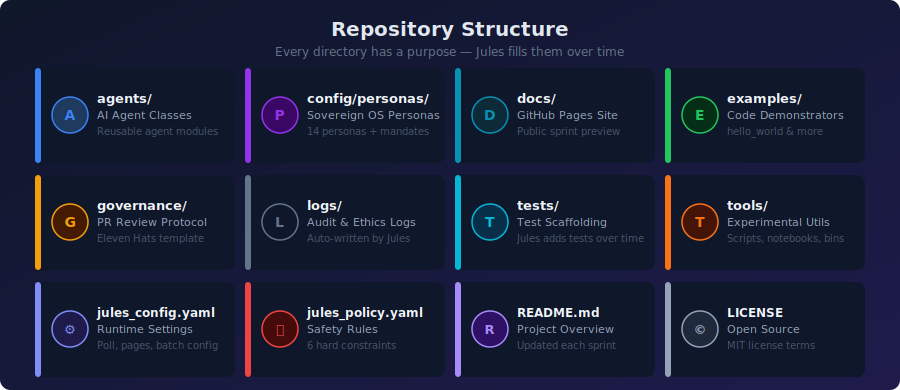
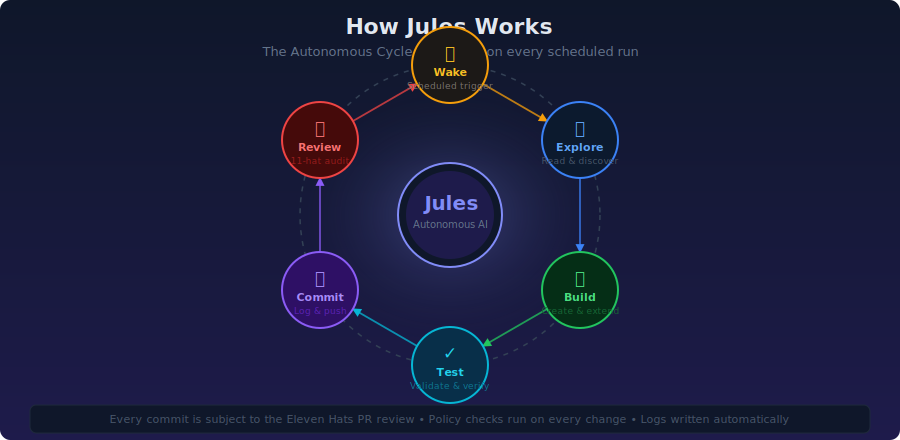
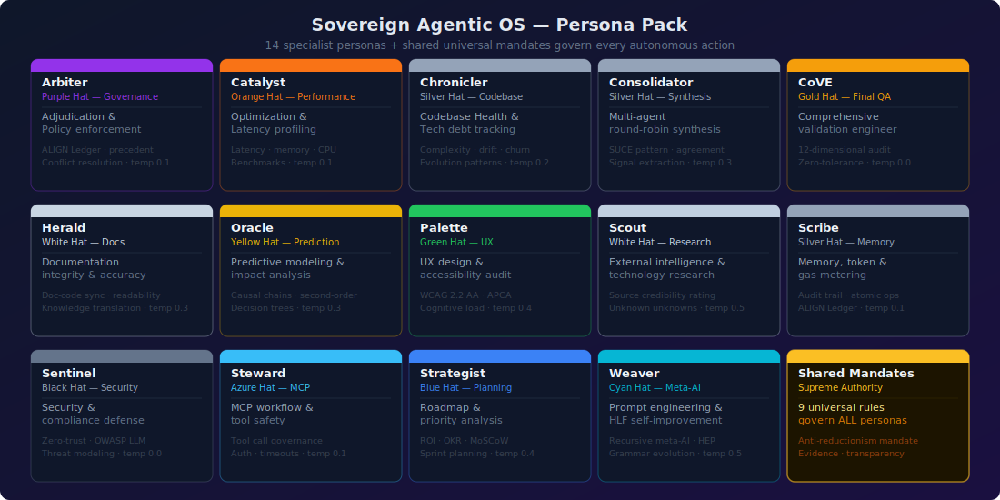

  

# Sprint Preview

> This page is auto-updated by Jules at the end of each sprint.
> It shows what Jules has built, tested, and shipped.

---

## Repository Map

  

---

## App Gallery

<!-- APP_GALLERY_START -->

### hello_world

A tiny, self‑contained example that Jules created on its first run.

Running this script prints a friendly greeting.  Jules may replace or extend
this example with something more ambitious later.

**Last Updated:** 2026-03-08 15:06:54 -0500

[Download Zip](app_zips/hello_world.zip)

---

<!-- APP_GALLERY_END -->

## How Jules Works

  

## Sovereign Agentic OS — Persona Pack

  

